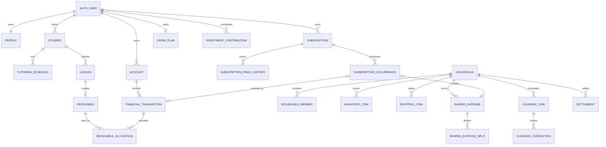

# Data Model

## 1. Modeling principles

1. **Actual movement has one ledger source:** `financial_transactions` is the source for money that actually entered or left an account.
2. **Operational facts remain separate:** lessons, receivables, subscription occurrences, shared expenses, and settlements are not transactions until linked.
3. **Household privacy boundary:** shared tables contain only shared facts; a private transaction link is visible only through an owner-authorized server projection.
4. **Immutable history where possible:** price history, cleaning completion, allocations, and audit events are append-oriented.
5. **Integer KRW:** amount columns use positive `bigint` with explicit direction/state.
6. **External idempotency:** provider, external ID, fingerprint, and request key prevent duplicate sync/event creation.

## 2. Entity relationship summary

## 3. Core tables

### `profiles`
Private user preferences: display name, optional school/major/year, locale, timezone, currency. School context is optional and not required for app operation.

### `households` / `household_members`
`households` defines the shared boundary. `household_members` supports owner/member role and invited/active/left status. Invitee email is stored only as needed for invitation acceptance.

### `students`
Owner-private tutoring client record. Important columns:

- `tutoring_type`: SUBJECT or SCHOOL_RECORD.
- `subject`: MATH/PHYSICS/CHEMISTRY or null under the invariant.
- `default_mode`: ONLINE/OFFLINE.
- `default_fee_amount`, `default_duration_minutes`.
- `offline_location`, `manual_fixed_meet_url`, `payer_alias`.

### `tutoring_schedules`
Weekly recurrence template, not a lesson. Contains weekday, local start time, timezone, duration, effective period, and active flag. Materialization must be idempotent.

### `personal_schedule_blocks`
Owner-private weekly time blocks that are not tutoring work and never materialize lessons or receivables. Stores a short title, weekday, local start time, duration, `Asia/Seoul`, an immutable owner-local creation order, and a 0–14 palette index. The creation order and palette index are assigned by a serialized database trigger rather than trusted client input.

### `lessons`
Immutable snapshot of scheduled work fields plus preparation and completion data. Calendar fields live here because each event is a lesson-level external resource.

### `receivables` / `receivable_allocations`
One receivable per completed lesson. Allocations join one or more actual transactions to one or more receivables and enable partial payments.

## 4. Finance tables

### `accounts`
Private account metadata and last-known provider balance. Full account number is never stored for display; use a provider reference and masked digits.

### `external_connections`
Metadata for Google/KFTC connection status and an encrypted secret reference. It must never contain plaintext refresh/access tokens in client-readable form.

### `sync_runs`
Records attempt/success/failure counts and redacted error codes so stale data is explainable.

### `transaction_categories`
System default or owner-specific categories. Defaults are visible to everyone; custom categories are owner-only.

### `financial_transactions`
Actual ledger row. Important fields:

- owner and account
- direction: IN/OUT
- kind: INCOME/EXPENSE/TRANSFER
- amount as positive integer
- category and personal/household scope
- source: MANUAL/BANK_SYNC/CSV_IMPORT/SYSTEM
- provider/external ID/fingerprint for idempotency
- `transfer_group_id` for paired legs
- description/counterparty and after-balance

A private transaction may be linked from a shared record, but shared projections must not reveal its account details to the roommate.

## 5. Subscription tables

### `subscriptions`
The recurring contract. Includes status, category, amount/cycle/dates, scope, payment account, descriptor, reminders, payer/split strategy, service URL, notes, and user-entered usage/decision fields.

### `subscription_price_history`
Effective-dated price versions. The base subscription amount is current convenience data; forecasts use history by due date.

### `subscription_splits`
Household responsibility in basis points. Sum is 10,000 for a household subscription.

### `subscription_occurrences`
One expected charge. It may link to one actual transaction and one shared expense. State includes upcoming/due/paid/skipped/cancelled/overdue.

## 6. Household operations

### `household_inventory_items`
Quantity, unit, shared/member ownership, storage, expiry, threshold, note. Use optimistic concurrency or atomic RPC for +/- operations.

### `shopping_items`
May originate from a low-stock item and later link to a purchase/shared expense. One open shopping item per source inventory item is recommended.

### `cleaning_tasks` / `cleaning_completions`
Task recurrence template and append-only completion history. Status is derived from `next_due_at`.

### `shared_expenses` / `shared_expense_splits`
Actual payer plus exact member owed amounts. The split sum must equal total. Link to the payer's private transaction when available.

### `settlements`
A deliberate net payment from one member to another, optionally linked to an actual transaction. Settlement does not rewrite historical expenses.

## 7. Grow tables

### `grow_plans`
Reserve target, monthly rule type (fixed/percentage), value, cap, and active state.

### `investment_contributions`
Monthly planned/actual contribution and linked transfer group. The actual contribution is derived/confirmed from transfer legs.

## 8. Matching/audit

### `match_suggestions`
Private suggestions with source transaction, target type/id, evidence JSON, confidence, state, and reviewer timestamp. Target IDs are polymorphic application references.

### `audit_events`
Append-only event envelope: actor, owner/household, action, entity, previous/new metadata with redaction. Store linkage facts, not secrets or full personal notes.

## 9. Index plan

At minimum index:

- every foreign key used for joins;
- owner ID + date on lessons, receivables, transactions, occurrences;
- household ID + due/date on inventory/cleaning/shared expenses/settlements;
- provider + external ID and owner + fingerprint unique idempotency keys;
- RLS membership lookup columns;
- lowercased invitee email and normalized descriptor/alias where used.

Use partial indexes for active/open/due states after measuring query patterns.

## 10. Server domain services

Avoid putting calculation logic into components. Implement services such as:

- `completeLesson()`
- `allocateReceivablePayment()`
- `materializeTutoringSchedule()`
- `materializeSubscriptionOccurrences()`
- `matchTransactionCandidates()` / `confirmMatch()`
- `createSharedExpenseWithSplits()`
- `calculateHouseholdSettlement()`
- `completeCleaningTask()`
- `adjustInventoryQuantity()`
- `calculateActualAvailableSurplus()`
- `recordInvestmentContributionTransfer()`

Each mutation must be transactional and idempotent where retries are possible.
